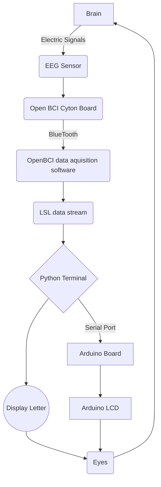

# Ultimate Invincible Super Universe First EEG Typewriter

This project aims to create a system that allows users to type using EEG data. We’ll use Python to acquire real-time muscle EEG data via the Lab Streaming Layer (LSL) and then display the selected characters on an Arduino LCD screen.

### Requirements

| name        | function |  other  |
| :--------  | :-----  | :----:  |
| BCI | data collection|[openBCI](openBCI.com)|

Python: `pip install pylsl`
Python: `pip install Serial`

### Algorithm implementation (flowchart)

````
# main python code
valuelist = []  # Obtaining EEG data
while len(valuelist) < 100:
    chunk, timestamps = inlet.pull_chunk()
    if timestamps:
        valuelist.append(chunk[0][1])

if (
    sum(i >= 0.9 for i in valuelist) >= 20
):  # Determine whether to select the current letter just now based on the threshold value
    ser.write(letter.encode())  # output to aduino
````




### Effect demonstration

[video](https://b23.tv/h7tQ6Z3)
picture here
