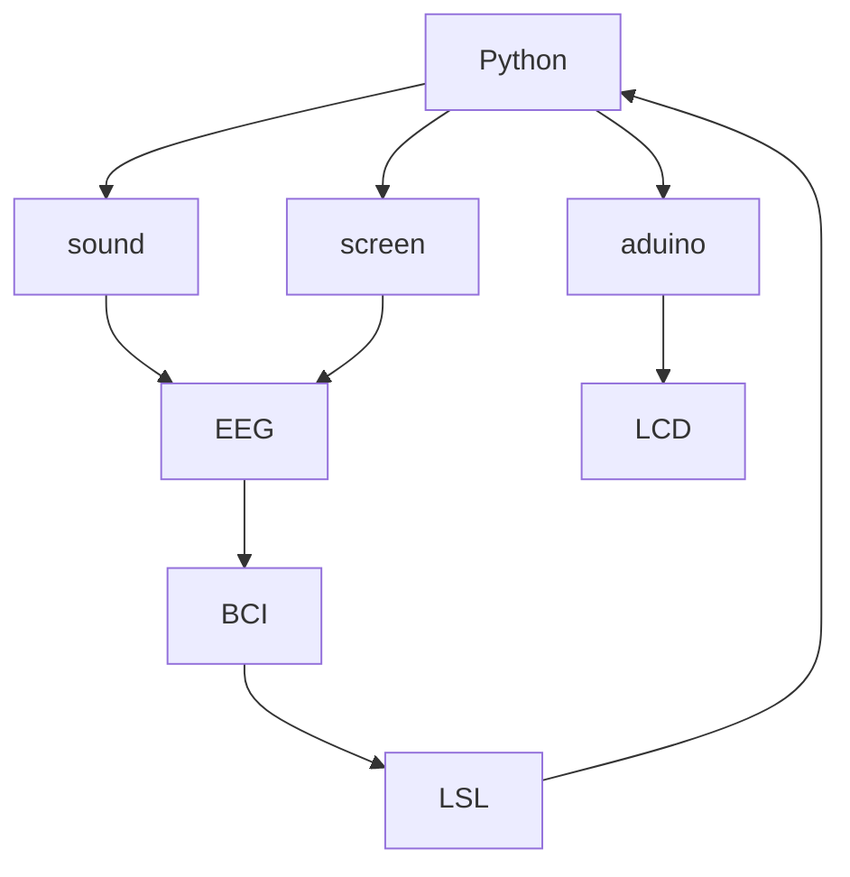

# Ultimate Invincible Super Universe First EEG Typewriter

This project aims to create a system that allows users to type using EEG data. We’ll use Python to acquire real-time muscle EEG data via the Lab Streaming Layer (LSL) and then display the selected characters on an Arduino LCD screen.

### Requirements

| name        | function |  other  |
| :--------  | :-----  | :----:  |
| BCI | data collection|[openBCI](openBCI.com)|

Python: `pip install blablablabla`

### Algorithm implementation (flowchart)

````
print("hello world")
````



### Effect demonstration

[video](https://www.bilibili.com)
picture here
