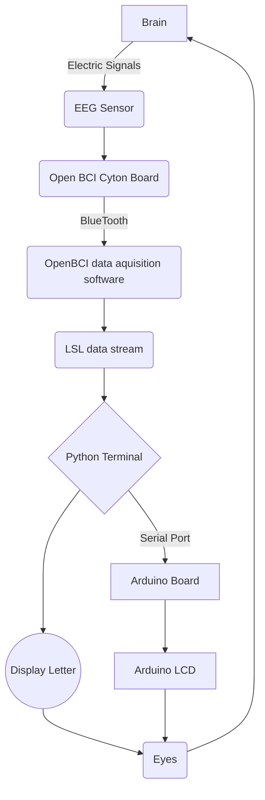

# Ultimate Invincible Super Universe First EEG Typewriter

This project aims to create a system that allows users to type using EMG (muscle movement) data. The 26 alphabets will show up in sequential order with a small delay in between letters, and users can select the letter by eliciating any muscle movement such as clenching the teech. We uses OpenBCI Cyton board to collect the data, then streams the data into Python via Lab Streaming Layer (LSL) for processing and classification. Finally, the selected character is sent to Arduino via serial port and displayed on the LCD screen.  

### Requirements

| name        | function |  website  |
| :--------  | :-----  | :----:  |
| Cyton board | data conversion|[openBCI](https://docs.openbci.com/GettingStarted/Boards/CytonGS/)|
| Python | data processing|[Python](https://www.python.org/downloads/)|
| Ear clip electrodes and wires | data collection|[openBCI](https://docs.openbci.com/GettingStarted/Boards/CytonGS/)|

Python: `pip install pylsl`
Python: `pip install pyserial`

### Algorithm implementation (flowchart)

````
# main python code
valuelist = []  # Obtaining EEG data
while len(valuelist) < 100:
    chunk, timestamps = inlet.pull_chunk()
    if timestamps:
        valuelist.append(chunk[0][1])

if (
    sum(i >= 0.9 for i in valuelist) >= 20
):  # Determine whether to select the current letter just now based on the threshold value
    ser.write(letter.encode())  # output to aduino
````




### Effect demonstration

[video](https://b23.tv/h7tQ6Z3)

picture here
